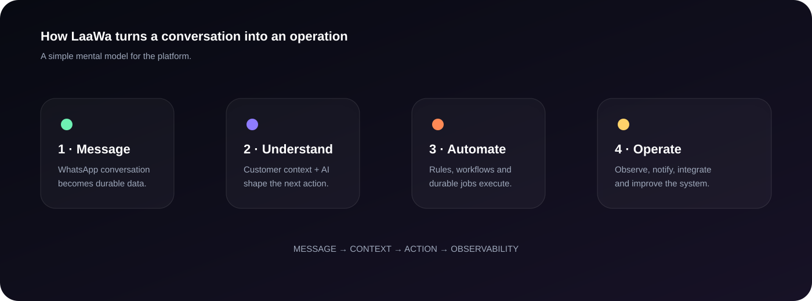
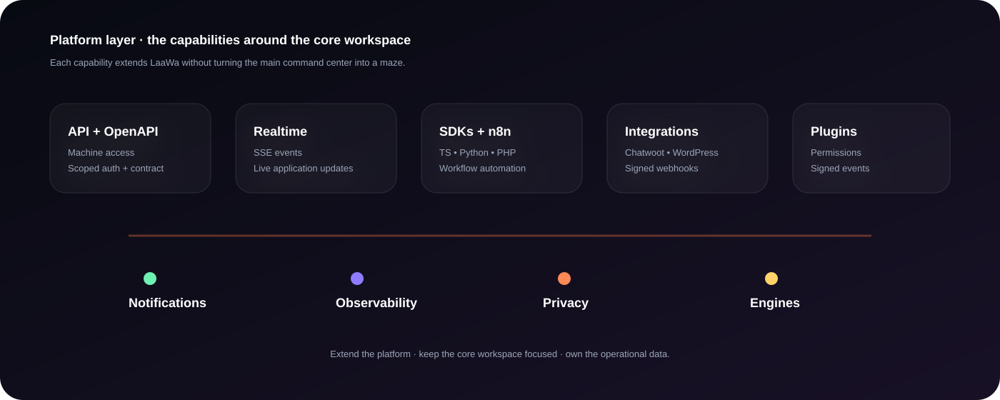
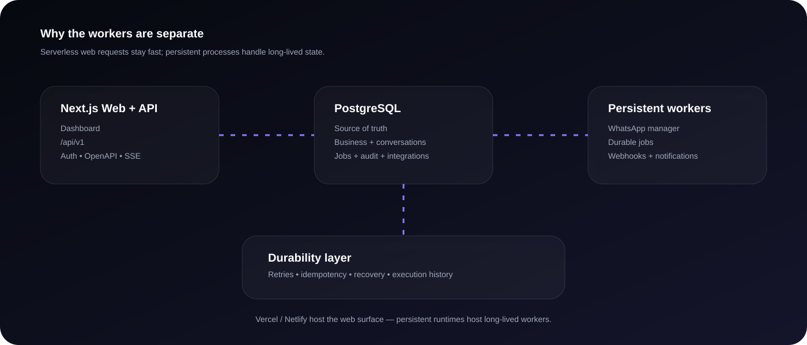

<div align="center">



# LaaWa

### AI Business Command Center for WhatsApp-first operations

**Conversations · Customers · AI · Automation · Integrations · Developer Platform**

[](https://nextjs.org/)
[](https://react.dev/)
[](https://www.typescriptlang.org/)
[](https://www.postgresql.org/)
[](https://www.whatsapp.com/)
[](LICENSE)

**Made in India · Developed with love by LaavaBee**

</div>

---

## What is LaaWa?

LaaWa is an **open-source, self-hosted AI business command center** built around WhatsApp customer conversations and the operational systems behind them.

It turns the business workflow into one connected surface:

> **Message → understand → decide → automate → execute → observe → improve**

Instead of treating WhatsApp as only an inbox, LaaWa connects conversations with contacts, Customer 360, AI, broadcasts, automation, durable jobs, integrations, notifications, realtime events and operational intelligence.

### Built for

- WhatsApp-first businesses
- Customer support and sales teams
- Lead capture and follow-up
- Appointment and workflow operations
- AI-assisted customer conversations
- Multi-account WhatsApp operations
- Developers building on top of LaaWa
- Teams that want to own their data and runtime

---

## See how it works



The mental model is simple: a conversation becomes durable business context, context drives decisions, automation executes the work, and observability closes the loop.

---

## The LaaWa experience

<div align="center">

| Command | Understand | Automate | Extend |
|:---:|:---:|:---:|:---:|
| Inbox | Intelligence | Automation | API |
| Contacts | Customer 360 | Durable Jobs | SDKs |
| Analytics | AI Studio | Visual Flows | n8n |
| Broadcasts | Timeline | Webhooks | Plugins |
| WhatsApp | Metrics | Notifications | Integrations |

</div>

The interface is designed as a **single premium operational surface** with responsive layouts, glass depth, 3D motion, focused hierarchy, micro-interactions and reduced-motion fallbacks.

---

## Core command center

### Inbox
WhatsApp-first conversation operations with persistent state and account-aware reply routing.

### Contacts
Business contacts connected to conversations and operational context.

### Customer 360
Customer identity, conversation history and operational timeline in one view.

### Analytics
Operational analytics backed by PostgreSQL data.

### Intelligence
AI-assisted business and conversation intelligence.

### AI Studio
Server-side Gemini integration for AI-powered workflows without exposing provider credentials to the browser.

### More Features
A broader command surface for broadcasts, business tools, jobs and connected capabilities.

### Automation
Scheduled and event-driven workflows with durable execution state.

### Visual Automation
Visual workflow construction on the same durable execution foundation.

### Jobs
Persistent background work, retries and execution history.

### Business
Business-level operational configuration and controls.

### WhatsApp
Persistent WhatsApp sessions managed outside disposable serverless requests.

---

## Platform — capabilities added around the core

Platform is intentionally separate from the original command-center navigation. It contains the developer, infrastructure and integration capabilities added after the core workspace.



| Capability | What it provides |
|---|---|
| **API Keys** | Scoped machine authentication, hashing, expiry and revocation |
| **Messaging API** | Programmatic message and conversation operations |
| **Realtime API** | Authenticated Server-Sent Events for live updates |
| **OpenAPI** | Machine-readable API contract |
| **Multi-engine architecture** | Account-aware WhatsApp engine abstraction |
| **SDKs** | TypeScript, Python and PHP foundations |
| **n8n** | Community-node workflow integration |
| **Integrations** | Chatwoot, WordPress and signed HTTPS webhooks |
| **Notifications** | Browser push and optional SMTP delivery |
| **Observability** | Prometheus-compatible metrics and snapshots |
| **Privacy** | Export, retention and workspace erasure controls |
| **Plugins** | Catalog, installations, permissions and signed event delivery |

Platform features have direct links in the application; they are not hidden behind a slide-out menu.

---

## Architecture



### Production separation

```text
Browser
   │
   ▼
Next.js dashboard + /api/v1
   │
   ▼
PostgreSQL ─────────────── source of truth
   │
   ├── Multi-WhatsApp manager / WhatsApp worker
   ├── Durable jobs worker
   ├── Webhook delivery worker
   └── Notification worker
```

Vercel and Netlify are suitable for the **web/API layer**. Persistent WhatsApp, durable-jobs, webhook-delivery and notification processes require a long-running Node runtime.

---

## Reliability by design

LaaWa is designed around durable operations rather than fire-and-forget requests.

- PostgreSQL-backed durable job state
- `FOR UPDATE SKIP LOCKED` worker-safe claiming
- Exponential retry backoff
- Stale-worker recovery
- Failed/dead-letter state
- Execution history
- Idempotency keys
- Durable webhook delivery
- HMAC-signed webhooks
- Account-aware WhatsApp routing
- Persisted WhatsApp session identity
- Audit trail
- Structured API errors
- Request IDs
- `Cache-Control: no-store` for sensitive API responses
- Production security headers and hardened CSP

---

## API platform

The versioned API lives under:

```text
/api/v1
```

Core surfaces include:

```text
/api/v1/health
/api/v1/openapi.json
/api/v1/keys
/api/v1/messages
/api/v1/conversations
/api/v1/contacts
/api/v1/events
/api/v1/engines
/api/v1/integrations
/api/v1/notifications
/api/v1/metrics
/api/v1/privacy
/api/v1/plugins
```

Authentication supports secure owner sessions and scoped API keys with `read`, `write` and `admin` scopes.

---

## Multi-engine WhatsApp architecture

WhatsApp connectivity is represented through an engine abstraction rather than coupling the entire application to one transport.

The current implementation includes the persistent `whatsapp-web.js` path while keeping account routing and engine descriptors behind a common interface.

Each WhatsApp account retains its own persisted session identity. Reply routing resolves the conversation's account before dispatching a message, preventing cross-account delivery mistakes.

---

## Developer ecosystem

### SDKs

Lightweight SDK foundations are included for:

- TypeScript
- Python
- PHP

They target the public `/api/v1` HTTP contract and do not embed the WhatsApp worker into client applications.

### n8n

An isolated n8n community-node package provides operations for:

- Message send
- Message listing
- Engine listing
- Health checks

### Integrations

Integration foundations include:

- Chatwoot
- WordPress
- Generic HTTPS webhooks

Webhook delivery uses encrypted configuration and HMAC-SHA256 signatures through `x-laawa-signature`.

### Plugins

The plugin architecture provides scoped permissions and signed event delivery around messages, conversations, contacts, broadcasts, WhatsApp connection state and webhook failures.

---

## Notifications

- Browser push through VAPID
- Optional SMTP email
- Notification feed
- Notification rules
- User preferences
- Dedicated notification worker

Credentials remain server-side.

---

## Observability

Prometheus-compatible metrics and JSON snapshots expose operational signals across accounts, messages, conversations, broadcasts, jobs, webhooks, notifications and automations.

The goal is practical visibility: **is the API healthy, is work progressing, and where is the system failing?**

---

## Privacy and data controls

Privacy is a platform capability, not an afterthought.

- Transactional JSON export
- Retention cleanup
- Explicit workspace erasure
- Sensitive credential exclusion from exports
- WhatsApp session identifiers excluded from exports
- Audit recording for destructive operations

---

## Security

LaaWa includes:

- HTTP-only owner sessions
- HMAC-signed session verification
- Hashed API credentials
- Scoped authorization
- Encrypted integration/plugin secrets
- HTTPS-only external callbacks
- HMAC webhook/plugin signatures
- CSP hardening
- Security headers
- HSTS in production
- Request correlation IDs
- Sensitive-response cache controls
- Recovery/error boundaries

### Secret hygiene

Never commit real:

- Gemini API keys
- WhatsApp credentials or tokens
- Database URLs/passwords
- Worker secrets
- Session secrets
- VAPID private keys
- SMTP credentials
- Plugin encryption keys
- Integration encryption keys

If a secret has ever been exposed in chat, screenshots, logs or source control, **rotate it before production use**.

---

## Open source & attribution

LaaWa is released as open-source software under the **MIT License**.

You are welcome to use it, study it, modify it, self-host it and build products or tooling with it, subject to the license in [`LICENSE`](LICENSE).

### If LaaWa helps your project

Please **give LaavaBee / Laava Studios credit** and link back to the original LaaWa repository when you use, fork or build substantially on top of the project. Please also **star the repository if you like LaaWa** — it helps the project get discovered and tells us the work is useful.

A simple attribution is enough:

> Built with [LaaWa](https://github.com/laavastudios/LaaWa) by LaavaBee / Laava Studios.

The MIT license's copyright and permission notice must remain with copies or substantial portions of the software.

---

## One-click web deployment

### Vercel

<div align="center">

[](https://vercel.com/new/clone?repository-url=https://github.com/laavastudios/LaaWa)

</div>

Vercel auto-detects Next.js. Configure production environment variables before enabling database-backed, AI and worker-connected features.

### Netlify

<div align="center">

[](https://app.netlify.com/start/deploy?repository=https://github.com/laavastudios/LaaWa)

</div>

The repository includes `netlify.toml` and targets Node 20 for consistent builds.

### Deployment model

```text
Vercel / Netlify
      │
      ├── Next.js dashboard
      ├── API routes
      └── serverless web surface

Separate persistent runtime
      │
      ├── WhatsApp manager
      ├── Durable jobs worker
      ├── Webhook delivery worker
      └── Notification worker

Shared PostgreSQL
      │
      └── Durable state / business data / execution history
```

For full deployment notes, see [`DEPLOY.md`](DEPLOY.md).

---

## Run locally

### Requirements

- Node.js 20+
- PostgreSQL / Supabase
- Gemini API key for AI features
- Persistent runtime for WhatsApp and background workers

### Install

```bash
npm install
```

### Environment

```bash
cp .env.example .env.local
```

Configure the owner/session, PostgreSQL, Gemini and worker variables required by the features you use.

### Database

```bash
npm run db:migrate
```

### Web app

```bash
npm run dev
```

Open `http://localhost:3000`.

### Full local stack

```bash
npm run laawa
```

### Individual workers

```bash
npm run whatsapp
npm run whatsapp:manager
npm run jobs
npm run webhooks
npm run notifications
```

---

## Project structure

```text
LaaWa/
├── app/                         # Next.js application + API routes
│   ├── api/v1/                  # Versioned API
│   ├── developer/               # Developer Center
│   ├── platform/                # Platform capability hub
│   └── ...                      # Command-center surfaces
├── components/                  # Reusable dashboard UI
├── lib/                         # Auth, API, DB, engines, metrics, privacy, plugins
├── worker/                      # Persistent WhatsApp + background workers
├── scripts/                     # Local orchestration and migrations
├── db/                          # PostgreSQL migrations
├── integrations/                # External integration packages
├── docs/                        # Developer documentation + visuals
├── netlify.toml                 # Netlify deployment configuration
├── next.config.ts               # Security + runtime configuration
├── SECURITY.md                  # Security policy
├── DEPLOY.md                    # Deployment guide
├── LICENSE                      # MIT license
└── README.md                    # Project overview
```

---

## Documentation map

| Area | Location |
|---|---|
| Full implementation record | [`docs/README.md`](docs/README.md) |
| Deployment | [`DEPLOY.md`](DEPLOY.md) |
| Security | [`SECURITY.md`](SECURITY.md) |
| SDK system | [`docs/sdk.md`](docs/sdk.md) |
| Developer Center | `/developer` |
| API reference | `/developer/docs` |
| OpenAPI | `/api/v1/openapi.json` |
| Platform | `/platform` |

The documentation index covers the implementation journey through API architecture, messaging, realtime, multi-engine support, SDKs, n8n, integrations, notifications, observability, privacy, plugins and production hardening.

---

## Visual documentation

The README intentionally uses **custom LaaWa visuals** to explain the system instead of relying only on walls of text:

- `docs/assets/laawa-hero.svg` — animated product hero
- `docs/assets/README-flow.svg` — animated message-to-operation workflow
- `docs/assets/README-architecture.svg` — animated production architecture
- `docs/assets/README-platform.svg` — animated Platform capability map

These are native SVG assets created for LaaWa and remain part of the repository.

---

## Design language

LaaWa follows a premium command-center visual system:

- Dark glass surfaces
- Layered depth and 3D perspective
- Controlled glow and ambient lighting
- Micro-interactions
- Motion-led state transitions
- Responsive layouts
- High-contrast operational hierarchy
- Premium hover states
- Reduced-motion fallbacks
- Minimal visual noise

---

## Philosophy

**Own the data.** Business state belongs in durable storage.

**Keep WhatsApp persistent.** Messaging sessions belong in a long-running worker, not a disposable serverless request.

**Make automation durable.** Retries, idempotency, execution history and failure states matter.

**Expose clean APIs.** The command center should be useful to humans and machines.

**Secure the edges.** Secrets, webhooks, plugins and integrations need explicit boundaries.

**Keep the core focused.** New developer and infrastructure capabilities belong in Platform instead of cluttering the original workspace.

**Stay genuinely open.** Self-hosting should not be artificially restricted by billing gates, subscriptions, credits or fake usage quotas.

---

<div align="center">

## LaaWa

**One command center. One operational data layer. One place to run the business.**

[Star LaaWa on GitHub](https://github.com/laavastudios/LaaWa) · [Explore the code](https://github.com/laavastudios/LaaWa/tree/main)

**Made in India · Developed with love by LaavaBee**

</div>
