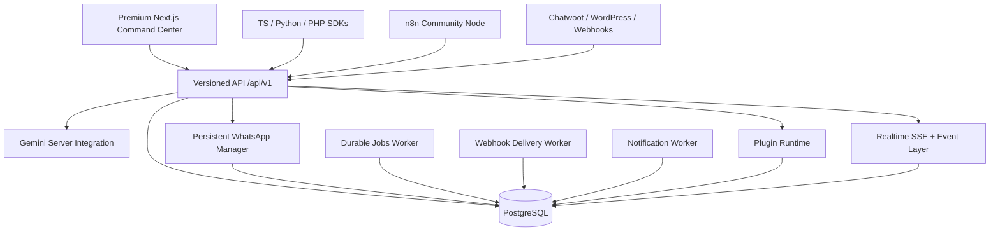

<div align="center">


# LaaWa

### AI Business Command Center for WhatsApp-first operations

**Conversations · Customers · AI · Automation · Integrations · Developer Platform**

[](https://nextjs.org/)
[](https://react.dev/)
[](https://www.typescriptlang.org/)
[](https://www.postgresql.org/)
[](https://www.whatsapp.com/)
[](#-one-click-web-deployment)

**Made in India · Developed with love by LaavaBee**

</div>

---

## What is LaaWa?

LaaWa is a **self-hosted AI business command center** built around WhatsApp customer conversations and the operational systems behind them.

It brings the full workflow into one premium workspace:

> **Message → understand → decide → automate → execute → observe → improve**

Instead of treating WhatsApp as a standalone inbox, LaaWa treats every conversation as business data that can connect to customers, AI, automations, jobs, broadcasts, integrations and operational intelligence.

### Built for

- WhatsApp-first businesses
- Customer support and sales teams
- Lead capture and follow-up
- Appointment and workflow operations
- AI-assisted customer conversations
- Multi-account WhatsApp operations
- Developers building on top of LaaWa
- Teams that want a self-hosted command center instead of a fragmented SaaS stack

---

## The LaaWa experience

<div align="center">

| Command | Understand | Automate | Extend |
|:---:|:---:|:---:|:---:|
| Inbox | Intelligence | Automation | API |
| Contacts | Customer 360 | Durable Jobs | SDKs |
| Analytics | AI Studio | Visual Flows | n8n |
| Broadcasts | Timeline | Webhooks | Plugins |
| WhatsApp | Metrics | Notifications | Integrations |

</div>

The dashboard is designed as a **single operational surface** rather than a collection of disconnected admin pages, with responsive layouts, depth, motion, glass surfaces, focused hierarchy and reduced-motion fallbacks.

---

## Core command center

### Inbox

Operate customer conversations from a WhatsApp-first workspace with persistent conversation state and account-aware reply routing.

### Contacts

Maintain business contacts and connect them to conversations and operational context.

### Customer 360

Bring customer identity, conversation history and operational timeline into one view.

### Analytics

Track operational activity through a dedicated analytics hub backed by PostgreSQL data.

### Intelligence

Surface AI-assisted business context and conversation intelligence.

### AI Studio

Use server-side Gemini integration for AI-powered workflows without exposing provider credentials to the browser.

### More Features

A command center for the broader operational surface: broadcasts, business tools, jobs, developer tooling and connected capabilities.

### Automation

Create scheduled and event-driven business workflows with durable execution state.

### Visual Automation

Build automation flows visually while keeping execution on the same durable backend foundation.

### Jobs

Inspect and operate persistent background work, retries and execution history.

### Business

Keep business-level operational configuration and controls close to the command center.

### WhatsApp

Connect and operate persistent WhatsApp sessions through the dedicated worker architecture.

---

## Platform — everything added beyond the core workspace

The **Platform** area is intentionally separate from the original command-center navigation. It contains the developer, integration and infrastructure capabilities added around the core product.

| Capability | Purpose |
|---|---|
| **API Keys** | Scoped machine authentication with hashing, expiry support and revocation |
| **Realtime API** | External Server-Sent Events surface for live application updates |
| **OpenAPI** | Live API contract available from the developer surface |
| **Multi-engine architecture** | Pluggable WhatsApp engine model with account-aware routing |
| **SDKs** | TypeScript, Python and PHP SDK foundations |
| **n8n** | Dedicated community-node integration for workflow automation |
| **Integrations** | Chatwoot, WordPress and signed generic webhooks |
| **Notifications** | Browser push and optional SMTP delivery |
| **Observability** | Prometheus-compatible metrics and operational snapshots |
| **Privacy** | Data export, retention and workspace erasure controls |
| **Plugins** | Plugin catalog, installations, permissions and signed event delivery |

The Platform page provides direct working links into these capabilities instead of hiding them behind a slide-out interface.

---

## Architecture



### Production separation

The web/API layer and persistent workers have deliberately different responsibilities:

```text
                    ┌───────────────────────────────┐
                    │        LaaWa Web / API         │
                    │        Next.js App Router     │
                    └──────────────┬────────────────┘
                                   │
                          ┌────────▼────────┐
                          │   PostgreSQL    │
                          │ Source of truth │
                          └───┬────┬────┬───┘
                              │    │    │
             ┌────────────────┘    │    └────────────────┐
             ▼                     ▼                     ▼
      WhatsApp Manager       Durable Jobs        Webhook Delivery
      persistent Node        persistent Node      persistent Node
             │
             ▼
      WhatsApp sessions
```

**Important:** Vercel and Netlify are suitable for the Next.js web/API layer, but their serverless functions are not a replacement for the persistent WhatsApp, durable-jobs or webhook-delivery processes.

---

## Reliability by design

LaaWa is built around durable business operations rather than fire-and-forget requests.

- PostgreSQL-backed durable job state
- `FOR UPDATE SKIP LOCKED` worker-safe job claiming
- Exponential retry backoff
- Stale-worker recovery
- Failed/dead-letter state
- Execution history
- Idempotency keys
- Durable webhook delivery
- Signed webhook payloads
- Account-aware WhatsApp routing
- Persisted WhatsApp session keys
- Audit trail
- Structured API errors
- Request IDs for API tracing
- `Cache-Control: no-store` on sensitive API responses
- Production security headers and hardened CSP

---

## API platform

LaaWa exposes a versioned API surface under:

```text
/api/v1
```

### API foundations

- Session authentication
- Scoped API keys
- `read`, `write` and `admin` scopes
- Request IDs
- Consistent success/error envelopes
- Account/workspace authorization
- Conversation authorization
- Realtime SSE
- OpenAPI contract
- External integration endpoints
- Engine discovery
- Metrics endpoints
- Privacy controls
- Plugin management

### OpenAPI

The live OpenAPI contract is exposed by the application at:

```text
/api/v1/openapi.json
```

The in-product Developer Center contains the API reference and developer navigation.

---

## Multi-engine WhatsApp architecture

WhatsApp connectivity is treated as an engine abstraction instead of hard-coding the entire application around one transport.

The current architecture includes the persistent `whatsapp-web.js` path while keeping account routing and engine descriptors behind a common interface.

Each account retains its own persisted session identity. Conversation reply routing resolves the conversation's account before calling the appropriate engine, preventing a response from being accidentally sent through another WhatsApp account.

---

## Developer ecosystem

### SDK foundations

Lightweight SDK foundations are included for:

- TypeScript
- Python
- PHP

The SDKs target the public API surface and do not require the WhatsApp worker to be embedded inside the client application.

### n8n

LaaWa includes an isolated n8n community-node package with operations for:

- Message send
- Message listing
- Engine listing
- Health checks

### External integrations

Supported integration foundations include:

- Chatwoot
- WordPress
- Generic HTTPS webhooks

Generic webhook delivery uses encrypted configuration and HMAC SHA-256 signatures through the `x-laawa-signature` header.

### Plugins

The plugin architecture supports event-driven extensions around:

- Messages
- Conversations
- Contacts
- Broadcasts
- WhatsApp connection state
- Webhook failures

Plugin permissions are scoped rather than giving every extension unrestricted access.

---

## Notifications

The notification system supports:

- Browser push through VAPID
- Optional SMTP email delivery
- Notification feed
- Notification rules
- User preferences
- A dedicated notification worker

Credentials remain server-side and should never be committed to source control.

---

## Observability

LaaWa exposes Prometheus-compatible operational metrics and snapshot endpoints for application visibility.

The observability layer is intended to answer practical questions such as:

- Is the API responding?
- Are background jobs progressing?
- Are webhook deliveries failing?
- Are notifications processing?
- How much operational work is flowing through the system?

---

## Privacy and data controls

Privacy controls are first-class platform capabilities rather than afterthoughts.

Included foundations:

- Transactional JSON data export
- Retention cleanup
- Workspace erasure with explicit confirmation
- Sensitive credential exclusion from exports
- WhatsApp session identifiers excluded from exports

The goal is to make destructive operations deliberate and auditable.

---

## Security

LaaWa includes production-oriented browser and API hardening:

- HTTP-only owner session cookie
- HMAC-signed session verification
- Scoped API keys
- Hashed API credentials
- Encrypted integration/plugin secrets
- HTTPS-only webhook delivery
- HMAC webhook signatures
- CSP hardening
- Security headers
- HSTS in production
- Request correlation IDs
- Sensitive response caching disabled
- Structured error boundaries
- Reduced accidental secret exposure in exports

### Secret hygiene

Never commit:

- Gemini API keys
- WhatsApp credentials/tokens
- Database URLs or passwords
- Worker secrets
- Session secrets
- VAPID private keys
- SMTP credentials
- Plugin encryption keys
- Integration encryption keys

If a secret is ever exposed in chat, screenshots, logs or source control, **rotate it before production use**.

---

## One-click web deployment

### Deploy to Vercel

<div align="center">

[](https://vercel.com/new/clone?repository-url=https://github.com/laavastudios/LaaWa)

</div>

Vercel auto-detects the Next.js application. Configure the required environment variables before using database-backed, AI or worker-connected features.

### Deploy to Netlify

<div align="center">

[](https://app.netlify.com/start/deploy?repository=https://github.com/laavastudios/LaaWa)

</div>

The repository already includes `netlify.toml` with the Next.js build configuration and Node 20 target.

### Deployment model

```text
Vercel / Netlify
      │
      ├── Next.js dashboard
      ├── API routes
      └── serverless web surface

Separate persistent runtime
      │
      ├── WhatsApp manager
      ├── Durable jobs worker
      ├── Webhook delivery worker
      └── Notification worker

Shared PostgreSQL
      │
      └── Durable state / business data / execution history
```

This separation is intentional and is required for reliable persistent WhatsApp sessions and background processing.

For the complete deployment notes, see [`DEPLOY.md`](DEPLOY.md).

---

## Run locally

### Requirements

- Node.js 20+
- PostgreSQL / Supabase
- Gemini API key for AI features
- A persistent runtime for WhatsApp and background workers

### Install

```bash
npm install
```

### Environment

```bash
cp .env.example .env.local
```

Configure the owner authentication values, session secret, database connection, AI credentials and worker configuration required for your deployment.

### Database

```bash
npm run db:migrate
```

### Web app

```bash
npm run dev
```

Open:

```text
http://localhost:3000
```

### Full local stack

```bash
npm run laawa
```

The development orchestrator starts the web application alongside the persistent services configured for local operation.

### Individual workers

```bash
npm run whatsapp
npm run whatsapp:manager
npm run jobs
npm run webhooks
npm run notifications
```

---

## Project structure

```text
LaaWa/
├── app/                         # Next.js application + API routes
│   ├── api/v1/                  # Versioned API
│   ├── developer/               # Developer Center
│   ├── platform/                # Platform capability hub
│   └── ...                      # Command-center surfaces
├── components/                  # Reusable dashboard UI
├── lib/                         # Auth, API, DB, engines, metrics, privacy, plugins
├── worker/                      # Persistent WhatsApp + background workers
├── scripts/                     # Local orchestration and migrations
├── db/                          # PostgreSQL migrations
├── integrations/                # External integration packages
├── docs/                        # Developer and implementation documentation
│   └── assets/                  # README / documentation visuals
├── netlify.toml                 # Netlify deployment configuration
├── next.config.ts               # Next.js security + runtime configuration
├── SECURITY.md                  # Security policy
├── DEPLOY.md                    # Deployment guide
└── README.md                    # This overview
```

---

## Documentation map

| Area | Location |
|---|---|
| Full implementation record | [`docs/README.md`](docs/README.md) |
| Deployment | [`DEPLOY.md`](DEPLOY.md) |
| Security | [`SECURITY.md`](SECURITY.md) |
| SDK system | [`docs/sdk.md`](docs/sdk.md) |
| Developer Center | `/developer` |
| API reference | `/developer/docs` |
| OpenAPI | `/api/v1/openapi.json` |
| Platform | `/platform` |

The documentation index covers the implementation journey through the current platform foundation, including API architecture, SDKs, n8n, integrations, notifications, observability, privacy, plugins and security hardening.

---

## Design language

LaaWa's interface follows a deliberate premium command-center visual system:

- Dark glass surfaces
- Layered depth and 3D perspective
- Controlled glow and ambient lighting
- Micro-interactions
- Motion-led state transitions
- Responsive layouts
- High-contrast operational hierarchy
- Premium hover states
- Reduced-motion fallbacks
- Minimal visual noise

The README hero is also a native LaaWa visual: an animated SVG built specifically for this project rather than a generic stock illustration.

---

## Philosophy

LaaWa is designed around a few hard rules:

**Own the data.**  
Business state belongs in durable storage.

**Keep WhatsApp persistent.**  
Messaging sessions belong in a long-running worker, not a disposable serverless request.

**Make automation durable.**  
Retries, idempotency, execution history and failure states matter.

**Expose clean APIs.**  
The command center should be useful to humans and machines.

**Secure the edges.**  
Secrets, webhooks, plugins and external integrations need explicit boundaries.

**Do not manufacture SaaS friction.**  
There are no artificial credits, subscriptions, billing gates or fake usage quotas in the self-hosted application.

---

## Current platform at a glance

<div align="center">

```text
┌──────────────────────────────────────────────────────────────┐
│                         LAAWA                                │
│                AI BUSINESS COMMAND CENTER                   │
├──────────────────────────────────────────────────────────────┤
│                                                              │
│  INBOX       CONTACTS       CUSTOMER 360       ANALYTICS     │
│                                                              │
│  INTELLIGENCE      AI      AUTOMATION      VISUAL FLOWS     │
│                                                              │
│  WHATSAPP     JOBS     BUSINESS     BROADCASTS              │
│                                                              │
├──────────────────────────────────────────────────────────────┤
│  PLATFORM                                                    │
│  API • REALTIME • ENGINES • SDKs • n8n • INTEGRATIONS       │
│  NOTIFICATIONS • OBSERVABILITY • PRIVACY • PLUGINS          │
└──────────────────────────────────────────────────────────────┘
```

</div>

---

## License / project status

LaaWa is a **private, self-hosted project** under active development. The repository is intentionally structured as a complete application rather than a marketing demo: web UI, API, persistence, workers, integrations, developer tooling and operational controls live together.

---

<div align="center">

### LaaWa

**One command center. One operational data layer. One place to run the business.**

Made in India · Developed with love by LaavaBee

</div>
